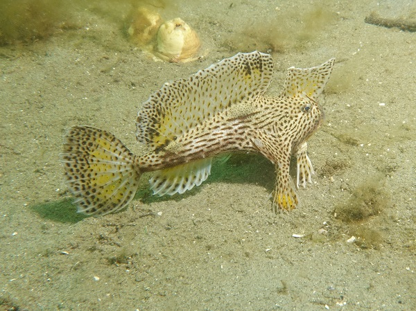

```{r setup, include=FALSE}
knitr::opts_chunk$set(
  results = 'asis',
  echo = FALSE,
  warning = FALSE,
  message = FALSE,
  fig.align = 'center'
)

#Load libraries
library(tidyverse)
library(gapminder)
library(kableExtra)
```


# Introduction
I have a background in taxonomic identification of marine invertebrates and plankton and working with data sets of species data and associated environmental and spatial details and associated imagery. I have been involved in field sampling using SCUBA diving to survey for introduced marine pests in Australian ports and underwater visual counts for species monitoring. I have used Excel, Access and SQL databases to manage data and have some experience in coding with Oracle and using R to manage data and produce graphs.


# My Project

The spotted handfish, _Brachionichthys hirsutus_, is a small fish that "walks on its hands" on the sediments rather than swimming. Its distribution has been heavily impacted on by human activities such as scallop dredging and predation by an introduced seastar _Amurensis australis_ . It is now restricted to a small area in southern Tasmania. The project data presented here examines the changes in the distribution of the handfish since monitoring of the population began at CSIRO in the late 1990's.

```{r echo=FALSE, out.width= "100%", fig.cap = "Spotted handfish, Brachionichthys hirsutus"}

```


Rather than yourself, this is the space to introduce your **project**. What are 
your goals, what is your data, how do you plan to work with it? Perhaps show some example data if 
it would help.

In order to build this demo poster correctly, you will also need to have installed the `tidyverse`, 
`gapminder`, and `kableExtra` packages.

## Preliminary results
Initially, from 1996- 2009 divers swam 100 metre underwater transects and counted the number of fish seen. This data was entered into Excel More recently, divers have towed a gps float and marked the position of each fish while swimming a variable length transect. This data was entered into Access.

Using the skills I have learnt in dataschool I have been able to "tidy" the data using the tidyverse to enable me to conduct some time-series analysis using GLMs.

{width=600px}

This section will demonstrate the different visuals you might want use to show off your 
project. Don't feel the need to go overboard, this is supposed to give a taste of the work you are
doing rather than being a publication ready document.

To get tables formatting correctly, use `knitr::kable` to convert the table to html format. If
you also want to have alternate row highlighting, pass the result to `kable_styling('striped')` 
from the `kableExtra` package.

**Tables**
```{r mytable, out.width='100%', echo = T}
knitr::kable(head(gapminder, n = 5), format = "html", caption = "A table of data") %>% 
  kable_styling("striped")
```

**Images from a file**


**Plots from R**
```{r standard-plot, out.width='60%', fig.align='center', fig.height= 4, fig.width=6, fig.cap="Yet another gapminder plot"}
gapminder %>% 
  filter(year == 1987) %>% 
  ggplot(aes(x = gdpPercap, y = lifeExp, colour = continent, size = pop)) +
  geom_point() +
  scale_x_log10(labels = function(b) format(b, scientific = F)) +
  scale_size(trans = "sqrt", guide = "none") +
  scale_color_brewer(palette = "Set1") +
  theme_linedraw() +
  theme(legend.position = "bottom")
```

Your figure and table captions are automatically numbered and can be referenced in the text
if needed: see eg. Table \@ref(tab:mytable) and Figure \@ref(fig:standard-plot)

# My Digital Toolbox

{width=100px}

What digital tools have you been using in your project? Do you expect that everything will be able 
to be completed within R, or will you need to work with multiple tools to get the right result?
Which of the digital skills needed for your project have you learned since starting Data School?

You can use all the usual R markdown features in writing a project summary, including lists:

* R - dplyr, ggplot, ...
* Python
* SQL

## Favourite tool (optional)

Is there a tool/package/function in particular that you've enjoyed using? Give it a special shout out here. What about this tool makes it your favourite?

{.pull-right width=100px}

No prizes for guessing mine:

# My time went ...

What parts of your project take the most time and effort? Were there any surprising challenges you
encountered, and how did you solve them?

# Next steps

What further steps do you wish your project could take? Or are there any new digital skills that you
are keen to develop as a result of your involvement in the Data School?

# My Data School Experience

This summary is mostly about your project. However we would also like to hear about other
parts of your Data School experience. What aspects of the program did you really enjoy? Have you
tried applying the skills you have learned in your daily work? Have you been able to transfer this 
knowledge to your team members? Any descriptions of the personal impact the program has 
had are welcome here as well!
